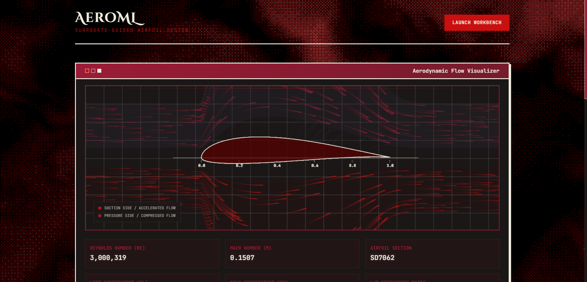
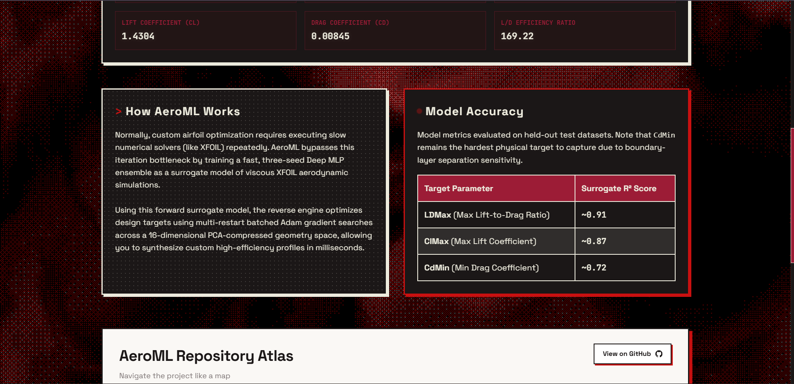
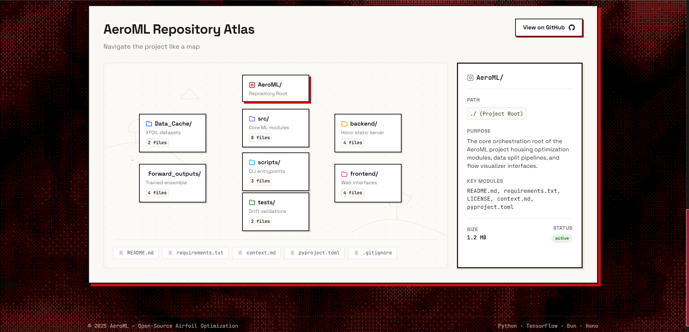
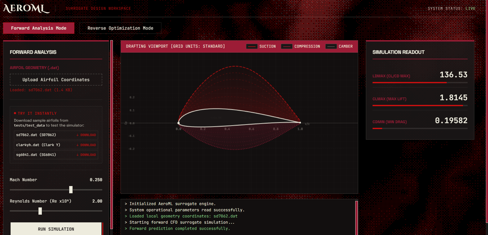
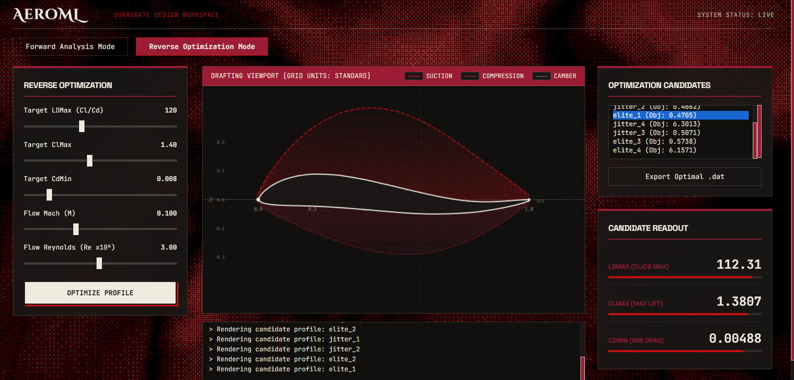

# AeroML

AeroML is a small deep learning system for airfoil design — it can look at an airfoil and tell you how it'll perform, or you can tell it how you *want* an airfoil to perform and it'll go find a geometry that gets you there.

I built this after getting curious about whether a surrogate model could replace a chunk of the trial-and-error in airfoil design — normally you'd run XFOIL over and over, tweaking geometry by hand and waiting on simulations. AeroML instead learns the mapping between geometry + flow conditions and aerodynamic performance, then uses that learned mapping to search backwards from a target.



## What it actually does

**Forward prediction** — give it an airfoil `.dat` file plus a Reynolds number and Mach number, and it predicts:
- `LDMax` — max lift-to-drag ratio
- `ClMax` — max lift coefficient
- `CdMin` — min drag coefficient

**Reverse design** — give it target values for those same three, plus your flow conditions, and it searches a compressed geometry space to propose airfoil shapes that should hit those targets. This isn't a generative model — it's a custom optimizer working over a PCA-compressed latent representation of airfoil geometry, using the forward model as the thing it's optimizing against. All restarts run as one batched, gradient-based search (finite-difference gradients + Adam, computed directly against the forward ensemble) instead of looping single-sample evaluations one at a time — the difference in practice is the reverse search finishing in seconds instead of tens of minutes. It also reports how much its own ensemble disagrees on each candidate, so you're not just getting a shape back with no sense of how confident the system actually is in it.

Both capabilities are exposed three ways: a web UI (below), programmatic APIs, and CLI scripts.

## The web app

There's a small full-stack app on top of the core package now — a landing page that explains the project, and a CAD-styled workbench for actually running predictions and reverse-design searches against the real trained models, not a mockup.



The landing page also has a "Repository Atlas" — the project structure laid out as an explorable map instead of a flat file tree, since I wanted a way to actually orient someone in the codebase rather than just link to GitHub and hope for the best.



**Forward Analysis Mode** — upload an airfoil (or grab one of the bundled samples), set Mach and Reynolds number, and get real predictions back from the trained ensemble, rendered over the actual geometry:



**Reverse Optimization Mode** — set target `LDMax`/`ClMax`/`CdMin` and flow conditions, and the batched optimizer searches the latent space for candidates. The candidate list shows the raw optimizer output (`elite_*` are seeded from nearby training examples, `jitter_*` are randomized restarts) so you can see the actual search behavior, not just a single "best" answer with the process hidden:



### Architecture

The web app is a thin layer on top of the same `src/aeroml` package the CLI scripts use — there's no separate reimplementation of the model logic for the web UI.

```
frontend/  →  backend/ (Bun + Hono)  →  scripts/api_bridge.py  →  src/aeroml (ForwardV3Predictor / ReverseV3Designer)
```

- **`frontend/`** — plain HTML/CSS/JS, no framework. The landing page's hero is a canvas-based generative flow-field visualization built on real airfoil geometry (not decorative noise), and the workbench is a CAD-instrument-styled interface for both prediction modes.
- **`backend/`** — a Bun/Hono server that does three things: serves the static frontend, validates incoming requests with Zod schemas, and rate-limits API traffic, before handing valid requests off to Python.
- **`scripts/api_bridge.py`** — a thin Python entrypoint that the backend spawns as a subprocess, which loads the real `ForwardV3Predictor`/`ReverseV3Designer` classes and returns JSON. This is the actual trained model running, not a mock — same code path as the CLI scripts.

**A specific thing worth knowing about, since it shaped a chunk of this app's validation logic:** Mach isn't continuous in this dataset — it only actually contains ~4 discrete training values (`0.0`, `0.10`, `0.25`, `0.50`). The workbench sliders are snapped to those exact values so you can't accidentally land somewhere the model was never trained. But the API itself doesn't *block* off-grid Mach values from other callers (a direct API request, a future client, etc.) — instead every prediction response carries a `mach_warning` field (`extrapolated`, `nearest_known_mach`, `distance`) computed against the known grid, and the UI surfaces it as a visible "OUTSIDE VALIDATED RANGE" badge if it ever comes back flagged. The idea is to make extrapolation *visible* rather than silently allowed or silently blocked.

## The data

Trained on XFOIL-simulated data (ncrit=9) across 6,000+ airfoil geometries. A few decisions worth knowing about if you're digging into the code:

- The raw dataset had multiple simulation sources per airfoil that didn't always agree with each other, especially on drag — so I settled on one canonical source (XFOIL ncrit=9) rather than training on a noisy blend.
- Train/val/test splits are grouped by geometry fingerprint, not split randomly row-by-row, so near-duplicate airfoils can't leak across splits and inflate the numbers.
- `CdMin` is trained in log-space, which handles the scale of drag values a lot better than raw.

The forward model is an ensemble of 3 seeds, and on held-out test data it lands around:

| Target | R² |
|---|---|
| LDMax | ~0.91 |
| ClMax | ~0.87 |
| CdMin | ~0.72 |

`CdMin` is the harder target of the three — drag is just noisier and more sensitive to fine geometry detail than lift. It has a specific, documented weak spot; see below.

## The low-drag CdMin gap, and what I tried

Aggregate `CdMin` R² (~0.72) looks fine, but it hides a real problem: restricted to just the lowest-drag quarter of the test set, `CdMin` R² collapses to **-5.29** — far worse than just predicting the mean. I dug into this properly rather than letting it sit as a footnote, so here's what I found and what I tried.

**Diagnosis.** The bad R² isn't uniform badness — `RMSE/MAE` on that slice is ~2.4x higher than you'd expect from well-behaved errors, meaning a relatively small number of severe outlier predictions are dragging the squared-error metrics down while the median prediction is actually reasonable (~74% of predictions land within 25% of the true value). Digging into the worst individual predictions, the pattern was stark: almost all of them were at Mach=0.5. `CdMin`'s median value roughly triples from Mach=0.0 to Mach=0.5 (wave-drag/compressibility onset, physically expected), and a *global* low-drag threshold catches a very different share of rows depending on Mach — about 44% of Mach=0 rows qualify as "low-drag," but only 8% of Mach=0.5 rows do. The model was essentially defaulting to the majority high-drag pattern at Mach=0.5 and missing the rare genuinely-low-drag cases there. (This is also the direct motivation for the Mach-grid warning system described above — it's the same underlying issue showing up at the product layer, not just the model layer.)

**What I tried, roughly in order:**
1. Loss reweighting toward low-drag rows (global threshold) — recovered some of the R² gap.
2. Reweighting further boosted for Mach≥0.49 rows specifically — similar result.
3. A properly Mach-conditional low-drag threshold (weight rows that are low-drag *relative to their own Mach bucket*, not a global cutoff) — the most theoretically correct version of reweighting, similar result again.
4. Giving `CdMin` a dedicated, deeper branch in the network (still sharing the early trunk with `LDMax`/`ClMax`) — no effect at all on its own; only helped when combined with reweighting, and even then didn't beat reweighting alone.
5. A fully independent model for `CdMin` — separate architecture, zero shared layers, plus new engineered features (Mach one-hot buckets, since Mach is really only ~4 discrete values in this dataset, plus Re-Mach interaction terms) — landed in essentially the same place as the simplest reweighting fix from step 1.

Five meaningfully different approaches, all converging to roughly the same recovery (about +1.0 to +1.4 R² points on that slice, nowhere close to positive). That consistency is itself the finding: this doesn't look like a model-capacity or feature-engineering problem anymore. My best guess is it's closer to a genuine data ceiling — XFOIL's own reliability plausibly degrades in this low-Reynolds, near-transonic, genuinely-low-drag corner, and the cached dataset has no convergence/quality signal I could use to confirm that without re-running simulations myself.

**Where this leaves the shipped model:** none of the experiments cleanly beat the baseline by enough to justify the added complexity, so the deployed model is still the original `cd_loss_only` ensemble. If you're using the reverse-design tool, be extra skeptical of results targeting low drag at Mach≥0.49 — the workbench will flag it, but it's worth knowing why.

## Setup and Installation

**Python side** — I'd recommend a dedicated conda environment so the TF/sklearn versions don't fight with anything else on your machine:

```bash
conda create --name aeroml python=3.10 -y
conda activate aeroml
cd AeroML
pip install -r requirements.txt
```

**Web app side** — the backend needs [Bun](https://bun.sh):

```bash
cd backend
bun install
bun run start
```

This serves both the frontend and the API from one process at `http://localhost:8080`. The backend spawns Python as a subprocess per request (via `scripts/api_bridge.py`), so your conda environment needs to be active/discoverable in the same shell you launch `bun run start` from.

## Training and Reproduction

To retrain the forward prediction ensemble model locally using your GPU, run the parameterized CLI training script:

```bash
python scripts/train_forward.py --seeds 42,52,62 --variant cd_loss_only --epochs 80
```

This script reproduces the exact ensemble training pipeline (data prep, scaling, training all ensemble seeds, computing metrics, and writing artifacts) and saves them to `Forward_outputs/`.

You can also run one-off reverse design searches directly from the CLI:

```bash
python scripts/run_reverse.py --ldmax 120 --clmax 1.4 --cdmin 0.008 --re 3000000 --mach 0.25
```

(Mach is one of the four values actually present in training data — see "The web app" above for why that matters.)

## Project layout

```
src/aeroml/                     Core package: data processing, features, models, training, evaluation, and runtime prediction
scripts/                        CLI scripts for retraining, one-off reverse searches, and the web app's Python API bridge
backend/                        Bun + Hono server: static file serving, request validation, rate limiting
frontend/                       Landing page + CAD-styled workbench (plain HTML/CSS/JS, no framework)
tests/                          Drift validation tests and local test airfoil dataset
Data_Cache/                     Preprocessed dataset + train/val/test split manifest
Forward_outputs/                Trained ensemble models + metrics
context.md                      My running notes on architecture decisions
FRONTEND_BLUEPRINT.md           Implementation roadmap for the web app build
```

The `Data_Cache` folder ships with the repo on purpose — it means you can clone this and run predictions or design searches immediately without re-parsing 6,000+ raw `.dat` files first.

## Tech stack

TensorFlow/Keras for the forward ensemble, scikit-learn for PCA and scaling, and a custom batched Adam optimizer (built directly on TensorFlow) for the reverse search. The web app runs on Bun + Hono + Zod on the backend, plain HTML/CSS/JS on the frontend, with a thin Python subprocess bridge connecting the two to the actual trained models.

## Where this is headed

The reverse search currently works best when your target performance is reasonably close to something in the training distribution — it gets less reliable the further out you push it, and the low-drag/Mach≥0.49 corner above is the clearest example of that. I'd like to revisit the low-drag `CdMin` gap with an actual look at XFOIL run quality in that regime rather than more model-side experiments, since that's the one lever I haven't pulled yet. Longer term I'd also like to add a proper geometry validity check that re-runs candidates through XFOIL directly rather than trusting the surrogate alone.

---

Built by [Sanidhya](https://github.com/Sanidhyavijay24) — feel free to open an issue if something breaks.